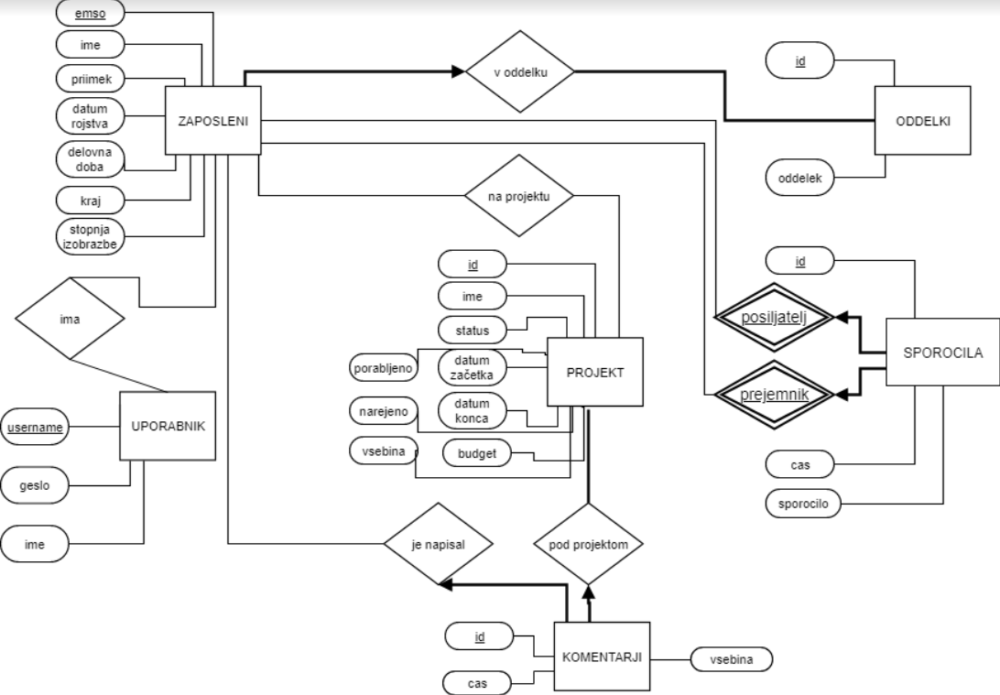

# BusinessNet
Projekt pri predmetu Osnove podatkovnih baz (2018/2019).

V aplikacijo se lahko registrirajo samo zaposleni v podjetju. Zaposleni se registrira z emšo številko. Največji vpogled ima direktor, ki ima na voljo vse projekte. Ostali zaposleni lahko spremljajo, komentirajo, nadgrajujejo samo projekte na katerih so določeni.

Vpis v aplikacijo - dostop do vsega:  
  username = direktor  
  password = direktor  

Izmisljen emso za profesorja: 19860721500502

Izmisljen emso za asistenta: 19880921500501

ER-diagram podatkovne baze aplikacije. 

